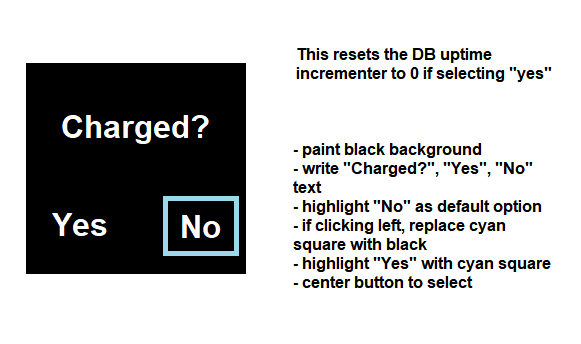
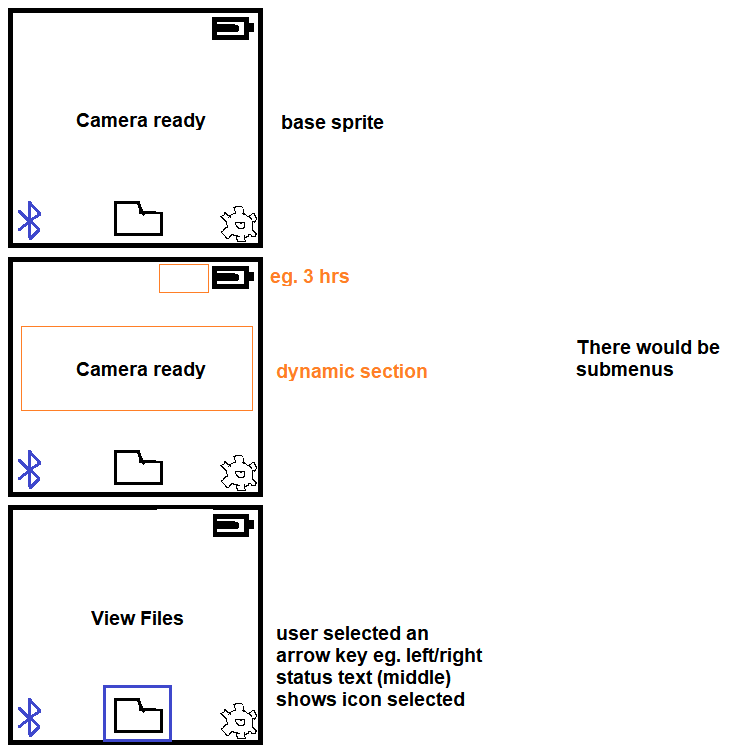
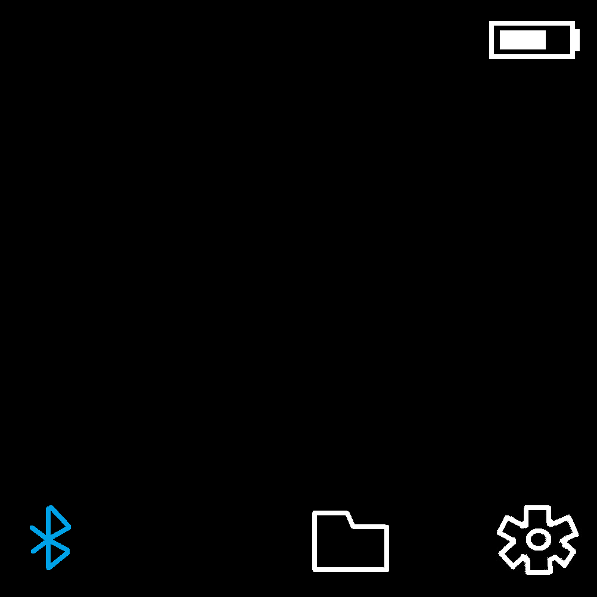
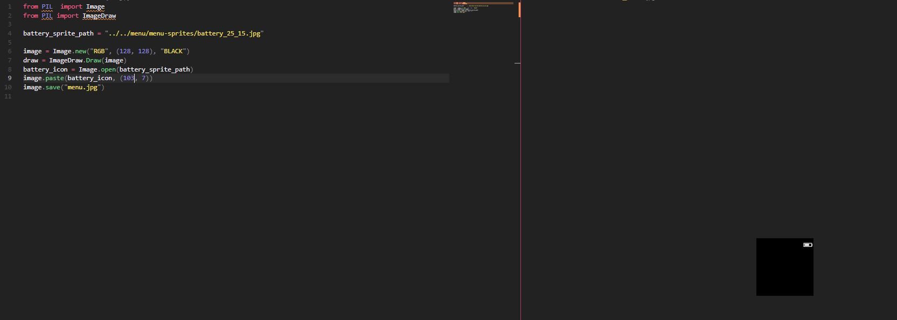

Concrete goals:

- camera turns on
- shows splash screen
  - current is a static image
  - [ ] future will be an animated chibi eyes character
- show the menu
- [ ] underline for active, none at first, camera ready message
  - need positions of each cursor, track previous to undo
- [ ] clicking center button (if camera preview not active) will open files... (center option) but not clear that's active
  - bring up cursor under files icon
- [ ] clicking arrows (left/right) moves cursor left/right
- [ ] up/down arrow allows you to go the upper row (camera toggle only) which can flip modes eg. photo or video
- [ ] boot
  - get battery status
  - bring up sensor(s)
- [ ] telemetry page
  - show the battery
  - cpu info
  - imu values (just accel 3-axis)
- [ ] settings page

- [ ] test if camera can stream and call libcamera at same time
  - don't think so, need that fast, cli-args way to take photos to pick up
  - shutter, iso, color balance values

underline for menu icon active is fine, top also looks tacky

astro mode also with photography

just point it at the sky

maybe assistive focusing via phone

12/27/2023

for video, switch the top-left out with photo, click that, toggle means in video mode

shutter operates the same (preview) but clicking again starts a video

need overlay/time

- [ ] after taking some photos, can't go back to menu, zoom out is fine

12/26/2023

9:13 AM

Alright I'm back on... slept

A little distracted in the morning

First thing I will tackle is the zoom-crop-panning

9:17 AM

It is so depressing outside... just grey, whole week, sad

9:29 AM

This camera code is nasty, I just copied over what I had from before

9:52 AM

quick break

10:27 AM

Unfortunately I don't feel energetic today but my brain is fresh

I will get it done, then I gotta return back to reality (poverty/being a dumbass)

10:32 AM

Hmm... I'm thinking about the cropping

11:08 AM

Testing the panning code, it keeps showing the menu between frames

11:11 AM

Oh... one issue is the button is not debounced

11:44 AM

Yeah this seems like a simple problem but not working

12:02 PM

New issue is when I back out of zoom in, it stops the oled update

12:10 PM

So I don't think the pan is working... I fixed the back button, also OLED paint collision

Seeing the file counter incrementing is pretty neat

I don't have the sub menus built yet, I suppose that could be today and tomorrow

12:15 PM

What is interesting is how the button presses affect the display

Down does not affect it which is odd... hopefully that doesn't mean that it's broken

No it's not, ran test

12:19 PM

Okay... so references don't work in python I guess, to pretty up a class property, temporarily assinging it to a variable then changing that variable is not changing the class property I guess... hmm

12:21 PM

No... even changing it to direct calls, not advancing

12:26 PM

Alright I fixed it, had a dumb fixed value

Quick food break, I do have to shop today but I'll do that later as my brain gets worse

I have to do the sub pages now

I have not looked into the faster photos yet but it's not terribly slow since the camera is started in advance/kept running

12:37 PM

man... the weather today sucks... it's rainy/snowy today and tomorrow

at least I have the indoor garden to film

I only have 1 more day, need to figure out what to prioritize because I have to stop working on this project for a while

I do want to make a submenu for sure

The settings would be a good one

File view too

Video seems like an easy one since that's a built in method, just need a recording status or red dot

and time overlay

I suppose you should know what size your file system is too... I'm using 128GB so it's not really a concern

The battery is also not factored in/tracked

I might just do this shopping now to get it out of the way/not think about it

The manual mode, I have to learn how to use it, I mean I know how regarding "set_options" or something like that, with picamera2 but this also needs like an incrementer interface, track the state (db or temporary) does it resume on boot sort of thing

There's nothing really useful to have settings for right now although I would like that gimmick of seeing the telemetry data

12:46 PM

File view would be hard... have to paginate them, split the tiles

Render with PIL... I mean it's not "hard" it's tedious

Then you gotta have an active thing, click it, open the photo... but you'd expect a camera to be able to do that

I'll do that tomorrow morning since that's a hard task

1:26 PM

Damn I am poor AF right now, my own fault but yeah

Going to the store...

2:28 PM

Back on

- [ ] video sub page
  - photo text top-left
  - center message "click to record"
  - first preview overlay (rec red square, time)
- [ ] file view (hard)
- [x] settings
  - telemetry option
- [x] telemetry page
  - show details of pi zero (1/2)
  - imu data
  - file system

2:39 PM

I want to get something done before I get into a vegetative state, I already partook in a snickers bar and mentos

2:58 PM

The issue is there's no hierarchy/relationships with the menu/state management

It would be cool if you had something like a JSON object define what is rendered

3:33 PM

As I add on menu pages/states I am seeing a pattern that could be used for future structuring/better code

4:06 PM

Alright I added raw telemetry in, can't get out though

---

12/25/2023

9:31 AM

Nice... got to sleep in

My fingers still hurt but not as bad

This time it's my thumb

The back right edge (top view) of my thumbnail

Anyway I reset master last night to the code that was ran at the park... I'll treat that as version 0.0.1

Mostly I don't want to track the devlog (this) in master, keep the madness away from the soup

I like it just to capture a snippet of my consciousness, it's like a rattling can of spare parts (Gir)

I need to see the end goal, what do I want?

- zoom-crop-pan (for focus)
- faster photo taking
- basic menu "framework"

- view files on camera (extra)

I'm printing the final barrel lens wrapper for the 8-50mm now

Yesterday I thought about the menu sprite stacking method, how that would be the way to go vs. a base image that has all the parts on it combined, I think pasting data vs. showing it is fast.

9:41 AM

Yeah that image delay has got to go

9:50 AM

I'm reading this post

https://forums.raspberrypi.com/viewtopic.php?t=352301

I have used that signal kill method before (for my security pi cam) but my concern is once you start it with certain parameters, will you be able to change them quickly?

The other thing is can the stream still work too.

I guess I'll find out right now

Damn... "pipeline handler in use by another process"

9:59 AM

Oh no... this is a skill gap thing, I think it is possible but hard for me right now

To modify/understand libcamera to use it with picamera2 together

A dumb solution is to keep the preview as is... then when taking a photo, kill the picamera2 instance and take a fast photo with libcamera

10:03 AM

Ooh... set controls nice

Saw here

https://forum.arducam.com/t/how-to-make-libcamera-still-faster/4898/2

Yeah I think I can go with this approach for now, what's nice is the exposure and what not can be set on the preview

I think it all starts with the menu so I'll start there

Hmm... db or file to store config...

- [ ] build current menu design

That's this one

These were the previous designs

 

 

You can see above how the sprites were pre-stacked, that would be hard to change

Also I changed the design anyway to see the current exposure/shutter values

10:13 AM

I'm like panicking, so much to do, where to start ha

10:16 AM

I think the menu layering/offset stuff is an important first step

Oh... I can actually mock the menu generation via making real images locally on the desktop hmm

Man's using his brain

10:43 AM

So yeah I can dial in the icons this way

Cool

11:04 AM

Okay I have laid out the menu, it's still not in a programmatic way, I just manually aligned everything to get the values... I could see how you'd turn this into a library eg. group things, shift them together, real-time render, here I'm using PIL and VS Code's photo view, CLI call to do a "hot reload" in a way

- [ ] add pi version detection (dump cpuinfo grep core count)

11:11 AM

Quick break, then start writing code

11:48 AM

Alright let's go, exploratory session is done, put the poompa music on and bust it out

12:45 PM

I'm editing via sftp

I'm stuck on this dumb subprocess output thing, can't get the number out

1:01 PM

So right now I have a painted menu from subparts

I don't have a state manager yet, doing that now

The menu right now has 5 parts:

- video/photo toggle
- shutter/exposure settings (need auto by default)
- files
- settings

With regard to the d-pad and back button the state manager will be a 2D array

Hold on

- camera on/ready
- shutter -> show live preview
  - cancel by hitting back
- any dpad button, activate center file
- left, auto or exposure
- up (from any) highlights toggle
- right is gear

1:47 PM

Damn I have a working menu now, still doesn't integrate with the stuff but yeah, it's navigatable at least

quick break

1:52 PM

dang it I wrote the file count code already, lost it

2:04 PM

Damn I'm losing the focus... mind is darting

2:14 PM

Back on, quick food break, bread is great man

I'm going to jump over to the live camera real quick, get that feature back

2:32 PM

Dang... battery died/too low to run camera preview/OLED, charging

There is still plenty of work I can do on the side

I am starting to lose it though the focus/productivity

2:34 PM

Where am I now, midwest

- have a display menu
- [ ] back button to exit live preview
- [ ] zoom-pan-crop (prioritize)
- [ ] faster photo taking
- [ ] sub pages of menu eg. file display
- [ ] manual mode

4:37 PM

OMG... it's too big jeez... how did I get this wrong

7:46 PM

done charging

it took like 5 hours to charge? damn

it was on for like a couple days ish... I still have to do that battery profiling feature

---

12/24/2023

10:49 AM

Let's goooo baby, early day, thought I'd have to work till 5:30 PM like the usual

last night was bad man, my finger tip hurt so bad had to take ibuprofen to sleep

I took one in the morning too in order to get through the morning part of the day

thankfully I can type

the camera has a crop factor of 5.5 apparently so the 5mm is equivalent to 27.5mm so my thought of 35mm wasn't far oof, same for 12mm being like a 100mm full frame

so... I'm not 100% like if I let myself sleep in... still kinda in work mode since my mind was comitted to working that 10 hour shift

also got up 4.5 hours ago

let's get to it

10:59 AM

There's so much to it I feel overwhelmed, I know that it needs to:

- interactive menu
- zoom-pan-crop
- record video

At minimum for the next video/major progress of this project

But I want the other stuff to work too, battery status... IMU is being watched

Had a thought today about the threads needing to use callbacks so I don't have overlapping events, particularly with the display

11:01 AM

quick break

11:32 AM

Damn I'm tired

I have to mentally wrap this project up on this break (3 days off in a row) because after that I have to start applying for tech jobs

Concrete goals:

- camera turns on
- shows splash screen
  - current is a static image
  - [ ] future will be an animated chibi eyes character
- show the menu
- [ ] underline for active, none at first, camera ready message
  - need positions of each cursor, track previous to undo
- [ ] clicking center button (if camera preview not active) will open files... (center option) but not clear that's active
  - bring up cursor under files icon
- [ ] clicking arrows (left/right) moves cursor left/right
- [ ] up/down arrow allows you to go the upper row (camera toggle only) which can flip modes eg. photo or video
- [ ] boot
  - get battery status
  - bring up sensor(s)
- [ ] telemetry page
  - show the battery
  - cpu info
  - imu values (just accel 3-axis)
- [ ] settings page

- [ ] test if camera can stream and call libcamera at same time
  - don't think so, need that fast, cli-args way to take photos to pick up
  - shutter, iso, color balance values

That's plenty there to guide what needs to be done

11:54 AM

At some point I do want an auto-battery-benchmark thing which pretty much just runs the camera's live preview for like 30 seconds, turns off, repeats... until the camera dies. It would keep writing to a file then later on next boot read that file and see the max lifetime.

It would then set the system against this eg. 80% of that time to make sure battery is kept in decent health

12:04 PM

I'm floundering, kind of chilling... wish I had a Christmas feast, personal problems

I'm still not seeing the full picture, of how this camera's code is structured... the top-down flow

Man... I wish I added a current shunt/adc to it, to get info on the battery ahh well...

The BMS cut off will turn the battery off/battery itself has protection too (not great, double but battery I had on hand)

12:11 PM

was trying to design some icon for the video/photography toggle but I might just use words

I was also thinking about the photo crop zoom pan thing..., it's just switching photo modes and then keeping track of offsets/what's painted on the screen

I still have to look into the cli-args for fast photo/settings

I do want that astro mode... will need to test it somewhere too

damn... I feel like this is a wasted day, I'm just tired, my 

I guess I'll just chill today, think and write them down

12:24 PM

Ooh.... I had a thought... I could even do birding with the ML hat cam lens

Until I build the second tripod version, I could use that lens for telephoto... although without stabilization it'll probably be bad

Stil... it is a lens not being used currently

Damn, I need to print another set of barrel wrappers for that hmm... but I'm intrigued... birding with a raspberry pi

12:36 PM

This lens is hardcore the 8-50mm it has 3 levels/rotation rings

yeah birding with 300mm can be done

12:38 PM

Yeah that's what I can do today, design/print the lens barrel wrappers around the 8-50mm that'll be the next outing is birding since it's winter and everything's dead right now

1:07 PM

Good thing I tried this... it's actually hard to focus this lens with the rpi... I'm trying this smaller adapter

1:33 PM

I had to use two rings to get it to be decent... the colors are bad... I mean it's a cloudy day so maybe and I'm not using any settings...

Idk if I want to commit to making the rings... it is nice to have a zoom lens though

8-50mm is nice, I'll do it, I have time

1:43 PM

Makes me realize need photo modes like "sunny" day

2:08 PM

Alright, ate some ramen, watched a diving/crabbing YT video

Now to design this lens barrel wrapper and print it.

I did have a thought about making the grip lines better looking

idk I'm manually extruding every line and there are a lot is the thing... I could cut back then be able to do fancy slices

cat's laying across my desk, nice

3:33 PM

Oh damn... I just realized I need the 3 values or at least exposure/iso

Those would be modified along with the aperture (manual)

Damn I have to rework the menu to show that

Ahh... the menu should be made from individual sprites/paste with offset

Easier to update

5:35 PM

Bro how did I get this design wrong damn

it's too short

I'll modify my aperture ring temporarily for my print but the one in the repo will be corrected

5:37 PM

Oh I got it, it was designed against 1 adapter ring depth

---

12/23/2023

8:15 PM

I'm super tired today, my fingers/hands hurt

I binge ate so I'm in a food coma

I wanted to note that I thought about having video/part of the next video that focuses on the camera UI/UX and footage

Anyway I need a video mode/icon to toggle between photo/video

Won't have audio but gotta have that cliche focus pull

---

12/22/2023

5:57 PM

I will write code today, I don't want to wait for the 3 days off I have from work

Won't be crazy progress but something

6:11 PM

damn I'm spent... will try

6:28 PM

There is a "system design" thing I still haven't seen/figured out yet

I have to make the pieces to see the bigger picture

6:35 PM

I'm glad for the Pi Zero 2 upgrade, it's snappy, easier to develop on

6:48 PM

Ooh... not even that far already having separation of concerns issues

7:11 PM

man I'm so tired... my eyes hurt lol

Trying to draw a box on an existing image, the other examples were on a basic black background

7:43 PM

Ugh... I need primitives, it's not dry

Also need to separate state from display logic eg. the menu vs. display code

7:44 PM

Ooh... I just had an idea... it could get annoying but when you point the camera at the ground, this chibi animation could briefly popup (blinking eyes)

That feature (blinking chibi animation) is on my list of things to do but for now just using that generated character

Damn I'm so tired... what I need to do is make this code simpler/reusable and then be able to pass in a flag (currently duplicated code) eg. if it's making a menu inactive it just flips the color of the line fill

The telemetry will show the IMU live readouts and details about the pi zero 1/2 eg. cores/ram/storage/etc... just data (excuse to show something cool)

the IMU thing I want the horizon level (it would go over a photo)

7:50 PM

I like the way react works, where you pass in parameters and it outputs a display

I'm thinking about doing that with the menu, will see

8:03 PM

Oh I forgot, I had an idea for an expansion USB mic/speaker it's like a T-shape (center speaker, strereo mic)

That would be an easy way to add that feature, but it's a custom chip design, outside my skill set right now

---

12/21/2023

7:16 PM

Tired af... have a headache

Printing the remaing lens parts... trying to do something for the menu

I had thought about having indidivual sprites that are stacked on top of the base image, this would make updates easier but you have to repaint them/stack in a row vs. paint 1 image once

7:44 PM

I'm not sure if this was a dream but while I was trying to/in the process of sleeping I thought about checking the variation/contrast from one pixel to the next (frame draw) and if it's not too drastic, keep it so only the new pixels get updated, this would be for the (desired) high FPS live preview.

This is so dumb it's hand drawn but it's not about the scenes (can be updated), just working on the flow.

I was also thinking for recording, red dot, side note no audio sucks, but also one less thing to worry about

11:05 PM

what the heck man... this lens cap is still too small, I'll have to do it again tomorrow, at least it's an hour print but still... this'll be the 3rd attempt

---

12/19/2023

2:16 PM

Feel slow today... printing stuff

Supposed to be designing the menu

2:56 AM

Still no motivation yet, maybe feeling something

4:00 PM

oh no... I measured wrong on the 35mm I measured including the base ring damn...

since it's printed orthogonal long ways, I was able to just slice off the excess.

I'll fix the design

