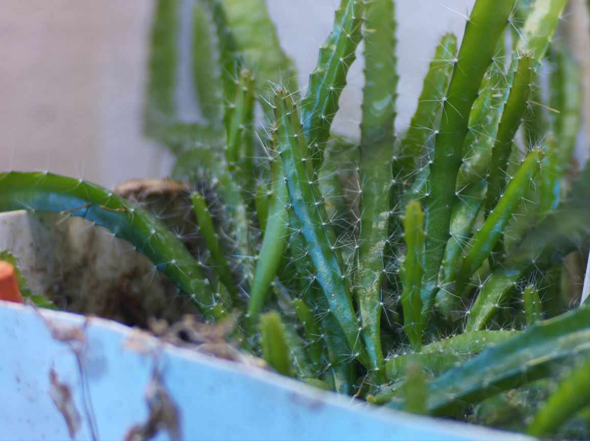

### About

#### Ver 1.0.0

A pi zero (1/2) camera body using the hq camera

### Who is this camera for?

This camera is not about quality. You obviously can't compare this to a real camera eg. a Sony Alpha. This camera is about writing your own software/a stepping stone for other camera designs.

#### Example photo

Next time I get to go to the park on a good day I'll update this photo (with a nice photo)

### Features

#### Implemented

- live preview with zoom-crop panning, take photo auto settings
- video recording (720p) auto settings
- IMU readout @ 60hz via settings/telemetry page
- basic menu navigation
- demo of file view

#### Not Implemented (yet)
- sqlite software battery indicator (CRON, uptime based no ADC)
- horizon leveling
- bluetooth file transfer via mobile app
- full multi-file view/single file management

### Estimated cost

$185.00 (using 35mm lens, major components only)

See `/camera/hardware` folder for more info

### Disclaimer

The 5V 1A micro usb charger's discharge cut off is very low around 2.5V, keep that in mind depending on your battery.
