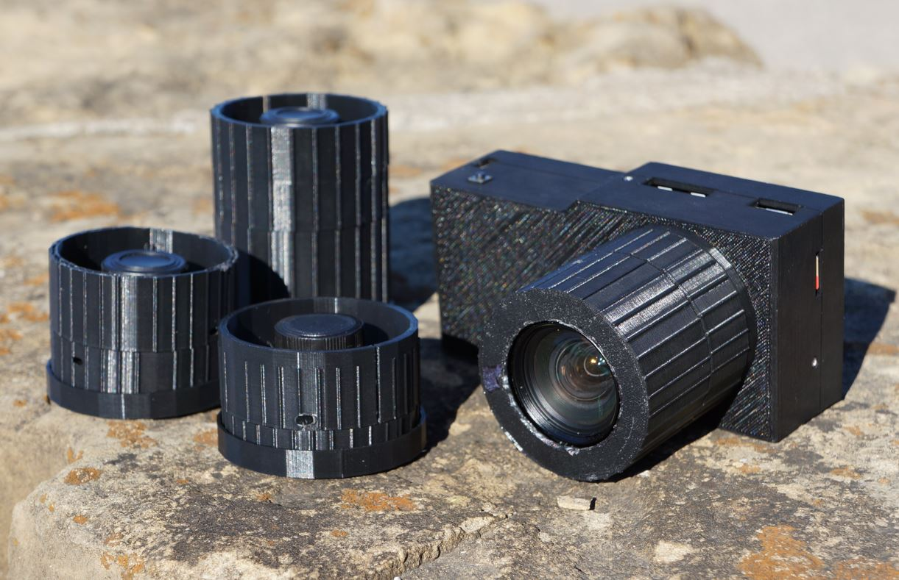

### About

#### Ver 1.1.0

A pi zero (1/2) camera body using the hq camera

### Who is this camera for?

This camera is not about quality. You obviously can't compare this to a real camera eg. a Sony Alpha. This camera is about writing your own software/a stepping stone for other camera designs.

#### Example photo

[full res samples](./full-res-samples/)

### Features

[See list](./camera/software/FEATURES.md) and [Changelog](./CHANGELOG.md)

### Estimated cost

$185.00 (using 35mm lens, major components only)

See `/camera/hardware` folder for more info

### Disclaimer

The 5V 1A micro usb charger's discharge cut off is very low around 2.5V, keep that in mind depending on your battery.

### Note

Refer to the [modular pi cam's software](https://github.com/jdc-cunningham/modular-pi-cam/tree/master/cameras/pi-zero/large-display/software) which is more current than this.

Eventually [pelicam](https://github.com/jdc-cunningham/pelicam) will be the general purpose DIY camera software
