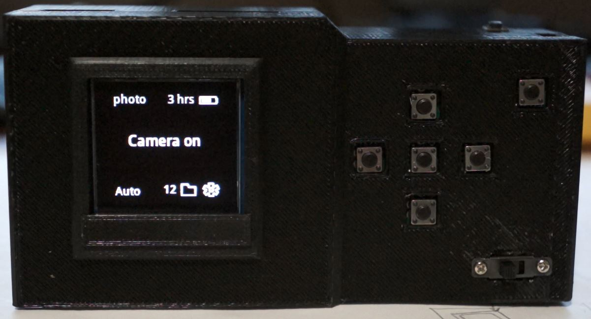

### About

#### Ver 1.0.0

A pi zero (1/2) camera body using the hq camera

### Features

- sqlite software battery indicator (CRON, uptime based no ADC) -- NOT IMPLEMENTED
- 1.5" OLED display for camera pass through/focus assist via digital crop zoom
- 10-axis IMU for horizon leveling (OVERLAY NOT IMPLEMENTED)
- bluetooth file transfer via mobile app (NOT IMPLEMENTED)
- 7 button interface (d-pad, back, shutter)

### Estimated cost

$185.00 (using 35mm lens, major components only)

See `/camera/hardware` folder for more info

### Disclaimer

The 5V 1A micro usb charger's discharge cut off is very low around 2.5V, keep that in mind depending on your battery.
