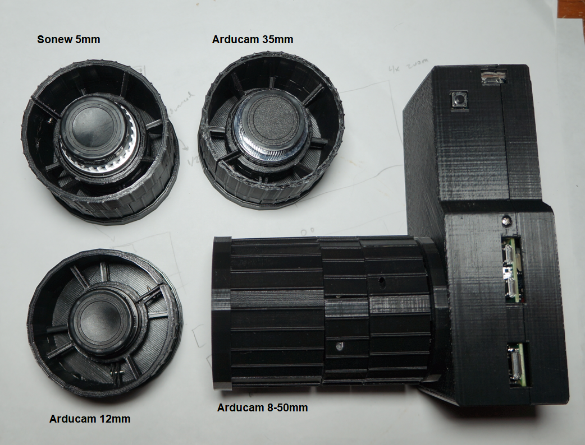

### Print times

- 8 hrs body front
- 6 hrs body back
- 35mm aperture ring - 2.5 hrs
- 35mm focus ring - 4.5 hrs

20% infill, supports, PLA, 50mm/s print speed

### Lenses

- 5mm sonew
- 12mm arducam
- 35mm arducam
- 8-50mm arducam

The 8-50mm uses 2 ring adapters (shorter). The other 3 use the RPi HQ Cam ring adapter.

