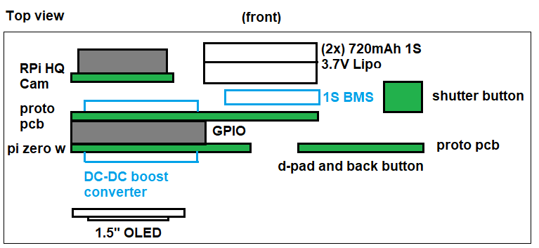
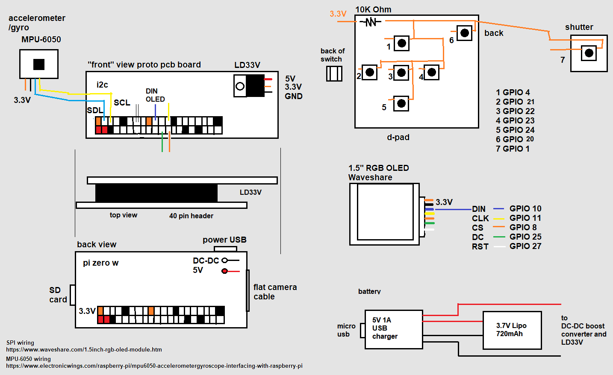
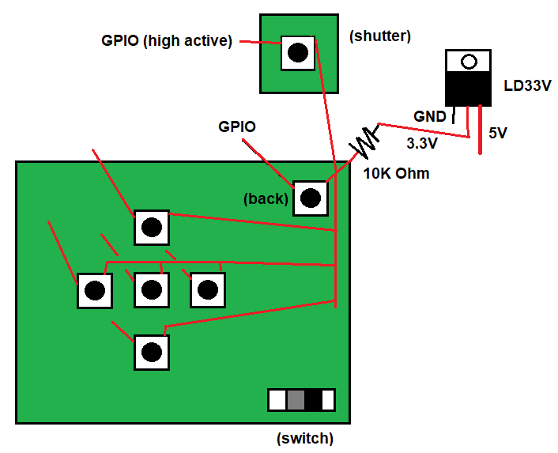

### Parts list

- $15.00 Pi Zero W
- $75.00 Raspberry Pi HQ Camera
- $2.00 720mAh 1S Lipo
- $0.80 DC-DC boost converter
- $0.80 5V 1A usb charger
- $0.12 LD33V step down converter
- $19.00 1.5" RGB OLED
- $60.00 35mm lens
- $32 12mm lens
- $60 5mm lens
- $10 GY-91 10-axis IMU

#### Alternate parts

- $9 18650 cell - 3400mAh 4.9A discharge
- $14.33 mEZD41503A-A step-up converter 5V@3A

M1.7*6 screws

### Part layout

### Pin out/wiring

### D-pad, back and shutter buttons

### Assembly order

- camera board (remove lens, screw, goes in from inside)
- imu (screw)
- shutter (glue)
- charger board (glue)
- battery (double sided foam tape or some glue/free floating)
- DC-DC free floating
- OLED (screws)
- push switch through (may have to bend ends temporarily, screw)
- dpad (glue)
- solder pi to hanger screw mount

join two halves together, 4 screws
