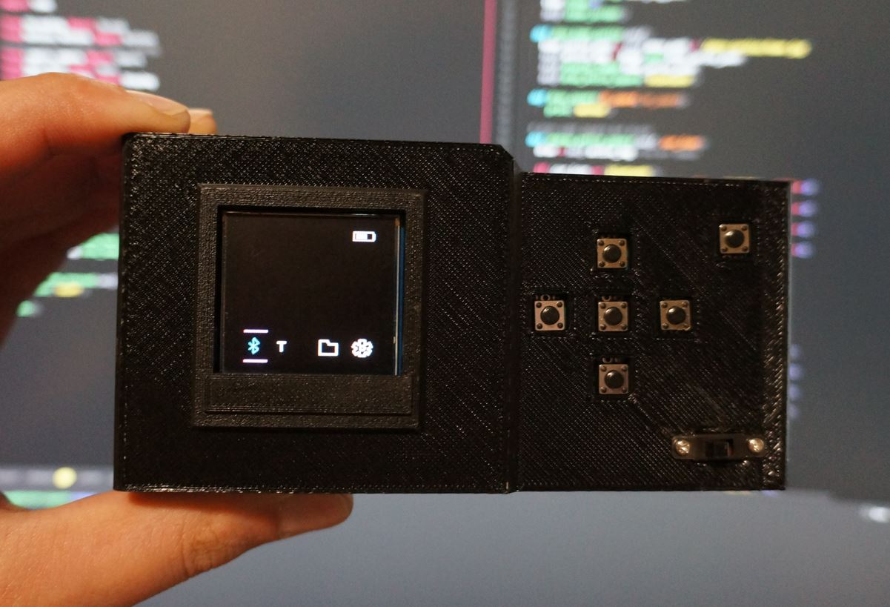

### Deps

- need SPI enabled (raspi-config)
- need pip3, smbus (via pip)

### Boot script

There is a boot script that runs `main.py` in the `software` folder

It uses systemd, see the basic service file below below (systemd service)

Create a file named `pi-cam.service` in the `/etc/systemd/system/` folder

```
[Unit]
Description=Start Pi Cam
After=multi-user.target

[Service]
Type=idle
WorkingDirectory=/home/pi/pi-zero-hq-cam/camera/software
User=pi
ExecStart=/usr/bin/python3 /home/pi/pi-zero-hq-cam/camera/software/main.py
Restart=no

[Install]
WantedBy=multi-user.target
Commands for myself
```

Add the service

```
$sudo nano /etc/systemd/system/pi-cam.service
$sudo systemctl enable pi-cam.service
$sudo systemctl daemon-reload
$sudo systemctl restart pi-cam.service
```

Verify it's working with

`$sudo systemctl status pi-cam.service`

### Menu

The menu is made by stacking layers... in general there is a base sprite (that has most icons in it) then the text/active menu square drawn around an icon is layered on top.


